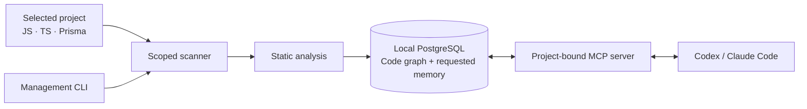

<div align="center">

# Integra CodeMemory

### Give your coding agent a map of your codebase.

Local code intelligence and persistent project memory for **Codex** and **Claude Code**.
Explore TypeScript, JavaScript and Prisma through symbols, call chains and model relationships.

[](https://github.com/iOwsla/integra-codebase-memory/actions/workflows/ci.yml)
[](https://github.com/iOwsla/integra-codebase-memory/releases)
[](LICENSE)
[](docs/mcp.md)

[Quick start](#quick-start) · [Documentation](docs/README.md) · [Releases](https://github.com/iOwsla/integra-codebase-memory/releases) · [Roadmap](ROADMAP.md) · [Contribute](CONTRIBUTING.md)

</div>

## Understand the code before changing it

A function name is only the beginning. Safe changes also require knowing who calls it, which models it touches, and which project decisions should survive the next AI session.

CodeMemory builds a local, queryable graph for a project you explicitly select. Your agent can follow relationships, retrieve focused source context and recall decisions you asked it to save. One shared installation serves your registered projects; each MCP connection stays bound to its own project.

**Current release: `0.1.0-alpha.21`.** Available for early adopters on Windows, macOS and Linux. The release pipeline tests all three platforms; sustained large-repository and production acceptance remain [open gates](docs/release-readiness.md).

## What you can do

| Your task | How CodeMemory helps |
| --- | --- |
| Understand an unfamiliar repository | Find declarations, read file outlines and inspect focused source context. |
| Plan a refactor | Follow callers, callees, references and dependency paths before editing shared code. |
| Trace Prisma usage | Move from a schema model to statically resolved queries, their files, call lines and operation names. |
| Review dead code and duplication | Find bounded candidates for source review, with explicit analysis limits. |
| Keep architectural decisions | Store requested notes, conventions and decisions in persistent, project-scoped memory. |
| Check whether evidence is current | Inspect index generation, progress, exclusions, diagnostics and unresolved references. |

Try prompts like these after connecting your agent:

> “Find the callers of `calculateTotal` and show the source before suggesting a refactor.”
>
> “Where is the Prisma `User` model queried? Include operation names and file locations.”
>
> “Find duplicate-code candidates in this module and check whether their behavior is actually equivalent.”
>
> “Remember this project decision: refunds must preserve a link to the original order.”

The agent decides when to invoke MCP tools. The installer adds [project instructions](docs/instructions/AGENTS.md) to guide discovery and verification.

## Why CodeMemory

- **Local analysis.** Parsing and graph queries run locally. CodeMemory performs no LLM inference, telemetry or source uploads. Your chosen AI client's data handling still applies to the source returned to it.
- **Explicit project boundaries.** Register the directories you want. The server does not discover and index every repository on your machine.
- **Relationships alongside source.** Query symbols and dependencies, then inspect the exact code behind a finding.
- **Visible limits.** Diagnostics, unresolved references, pagination and source-preview bounds help distinguish evidence from assumptions.
- **One shared runtime.** Install once, register projects as needed, and update the active runtime across existing enabled registrations.
- **MIT licensed.** Inspect the implementation, contribute regressions, or adapt it to your workflow.

## Quick start

Open a terminal **in the project you want to index**. Install **Bun 1.3.3+** and **Git** first. The bootstrap prepares the shared CLI, Docker and a dedicated PostgreSQL service. Docker permissions, first-run setup or a Windows reboot can require interaction. Releases currently require Bun and workspace dependencies; they are not standalone binaries.

Choose `codex`, `claude` or `both`. The examples below configure both clients. Omit `--write` / `-Write` to preview the selected-project installation.

### macOS and Linux

```sh
curl -fsSL https://raw.githubusercontent.com/iOwsla/integra-codebase-memory/v0.1.0-alpha.21/bootstrap.sh | sh -s -- --project "$PWD" --client both --write
export PATH="${XDG_DATA_HOME:-$HOME/.local/share}/integra-code-memory/cli/bin:$PATH"
```

Add the printed CLI directory to your shell profile to retain it in future terminals.

### Windows PowerShell 5.1 or 7

```powershell
$installer = (Invoke-WebRequest -UseBasicParsing 'https://raw.githubusercontent.com/iOwsla/integra-codebase-memory/v0.1.0-alpha.21/bootstrap.ps1').Content
& ([scriptblock]::Create($installer)) -Project (Get-Location).Path -Client both -Write
```

Installation and updates repair the persistent user PATH automatically. The PowerShell installer also refreshes its invoking session. After a CLI update, restart existing terminal windows or the IDE hosting them.

### Connect and verify

1. Open the selected project in Codex or Claude Code and reload/approve its MCP connection if prompted.
2. Ask the agent to run `codebase_status` and verify the selected root. Automatic indexing starts when the connection opens.
3. Wait for a published index and review diagnostics before relying on results. In a terminal, `codememory status --watch` follows progress.

The managed index database listens on `127.0.0.1:55433`. To use an already prepared external index database, add `--skip-services` / `-SkipServices` and retain your `DATABASE_URL`. Use a dedicated index database, not your application's production database.

If setup requests a Windows reboot, return to the project directory afterward:

```powershell
codememory system status
codememory system setup --project (Get-Location).Path
```

[Platform installation and recovery](docs/installation.md) · [Codex setup](docs/setup/codex.md) · [Claude Code setup](docs/setup/claude-code.md)

## Everyday workflow

Run project commands from the directory you want to select; no path argument is required:

```sh
codememory projects add --client both
codememory index
codememory status --watch
codememory projects list
```

`index` shows live stages, sampled filenames and elapsed time on stderr, while its final stdout remains JSON. Use `index --no-progress` for quiet operation or `status --watch --json` for status events.

Use `projects add --no-index` if services are not ready, or `--external-db` for an external index database. Selecting a child directory keeps that exact scope; it does not silently expand to the parent Git root.

To disable a registration, close its active MCP sessions and run `codememory projects remove --yes` in that project. Source, index and memory are retained. See the [CLI guide](docs/installation.md) for service recovery and separate data-purge operations.

## Update once for your registered projects

```sh
codememory updates  # Check for a published release
codememory update   # Install it into the shared runtime
```

On Windows, `codememory.cmd` is also available. If an older PATH entry prevents command discovery:

```powershell
& "$env:LOCALAPPDATA\integra-code-memory\cli\bin\codememory.cmd" update --version v0.1.0-alpha.21
```

The updater validates the release, preflights enabled registrations, backs up changed settings and stops verified CodeMemory processes before switching the shared runtime. Project scopes and index data are preserved. Reconnect open MCP clients afterward. Update checks do not install releases in the background; set `CODEMEMORY_UPDATE_CHECK=0` to disable checks.

**Using alpha.16 or older?** Follow the [one-time migration guide](docs/installation.md#shared-runtime-updates). Keep the selected project's existing client and database mode.

## Prisma: from schema to calling code

CodeMemory indexes models, fields, enums, relations and foreign-key relationships alongside JS/TS sources. Query resolution follows the client and model delegate through supported static bindings; it does not depend on a variable being named `prisma`.

```ts
import { PrismaClient as Engine } from '@prisma/client';

const database = new Engine();
const user = database.user;

export function loadUsers() {
  return user.findMany({ where: { active: true } });
}
```

Search for `User` with `search_symbols` using `kinds: ["MODEL"]`, then pass the selected model ID to `find_references`. Results can identify `loadUsers`, its file, call line and `findMany` operation. Multiple schemas remain distinct: select the correct model ID.

Arbitrary runtime factories, client extensions and raw SQL are not fully resolved. See the [Prisma support matrix and examples](docs/prisma.md).

## How it fits together



The scanner respects `.gitignore`, configured exclusions, size limits and nested repository boundaries. Symlinks are excluded. The parser reads the scanner's permitted source set; completed graph publication is transactional.

Unchanged projects reuse their index. Source changes currently trigger conservative semantic re-analysis of the selected project. Session-owned watchers reconcile changes and shut down with their MCP process. There is no global indexing daemon.

### MCP tool groups

| Purpose | Tools |
| --- | --- |
| Status and discovery | `codebase_status`, `search_symbols`, `search_code` |
| Source context | `get_symbol`, `get_file_outline`, `get_file_context` |
| Relationships | `find_references`, `find_callers`, `find_callees`, `trace_dependencies` |
| Quality review | `find_dead_code_candidates`, `find_duplicate_code` |
| Explicit memory | `remember`, `search_memory` |

[Architecture](docs/architecture.md) · [Project isolation](docs/project-isolation.md) · [MCP protocol](docs/mcp.md) · [Project memory](docs/memory.md)

## Coverage and trust

JavaScript, TypeScript and Prisma are supported within the documented static analysis scope. Kotlin and other language adapters are not implemented. Dynamic dispatch and external dependencies can remain unresolved.

`READY` means a graph is available, not that all relationships are known. Inspect `incompleteReasons`, diagnostics, exclusions and unresolved references. Follow pagination; a truncated preview is not a whole function. A symbol with no recorded callers is a review candidate, not proof that it can be deleted.

Large repositories can require more parser time and memory. See [indexing configuration](docs/indexing.md), [analysis limitations](docs/limitations.md) and [verification evidence](docs/verification.md). No production throughput or memory guarantee is claimed.

## Documentation

Start with the [documentation hub](docs/README.md), or go directly to:

- [Installation, updates and troubleshooting](docs/installation.md)
- [Prisma schema and model usage](docs/prisma.md)
- [Dead-code and duplication reports](docs/quality-reports.md)
- [Parser coverage](docs/parser.md) and [index configuration](docs/indexing.md)
- [Roadmap](ROADMAP.md) and [release acceptance](docs/release-readiness.md)
- [Changelog](CHANGELOG.md) and [GitHub releases](https://github.com/iOwsla/integra-codebase-memory/releases)

## Contribute and help shape the project

Useful contributions include small reproductions for missed relationships, platform installation feedback, documentation improvements and parser regressions. Read [CONTRIBUTING.md](CONTRIBUTING.md) for setup and review expectations.

[Report a bug](https://github.com/iOwsla/integra-codebase-memory/issues/new?template=bug_report.md) · [Request a feature](https://github.com/iOwsla/integra-codebase-memory/issues/new?template=feature_request.md)

If CodeMemory helps your workflow, star the repository and share a reproducible, redacted example of what works or what needs improvement. Real usage feedback helps set priorities. For vulnerabilities, follow [SECURITY.md](SECURITY.md).

## License

[MIT](LICENSE) — Copyright © 2026 CodeMemory contributors.
