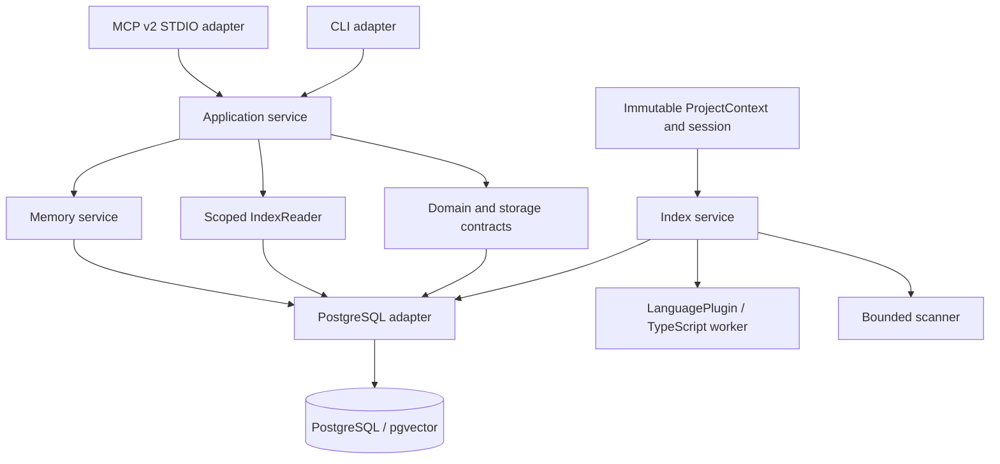

# Architecture

`core` defines domain types and ports; it imports no PostgreSQL, MCP or CLI code. `application` composes project-scoped queries. `IndexReader` provides bounded queries within a consistent generation. `graph` and `search` retain pure snapshot helpers for offline use; the application query path uses the SQL reader. `memory` handles explicit creation and lifecycle. `indexer` coordinates discovery, static analysis, publication and session lifecycle. `plugin-sdk` exposes plugin contracts. `plugin-typescript` contains compiler-specific logic and a Bun subprocess adapter. `database` owns SQL and migrations. `shared` owns canonical identity and path helpers. `test-utils` creates disposable repositories and databases.

Index query metadata and bounded results share one read-only REPEATABLE READ transaction. The compact file manifest used for index reconciliation also uses REPEATABLE READ; full snapshots remain available for inspection and offline utilities. Graph publication is transactional across the selected project, stronger than file atomicity. A dedicated connection holds a project advisory lock from pre-scan state read through publication. Memory is stored independently and survives code index cleanup.

No global mutable active project, source-code mutation tools, framework inference, telemetry or cloud calls exist.
